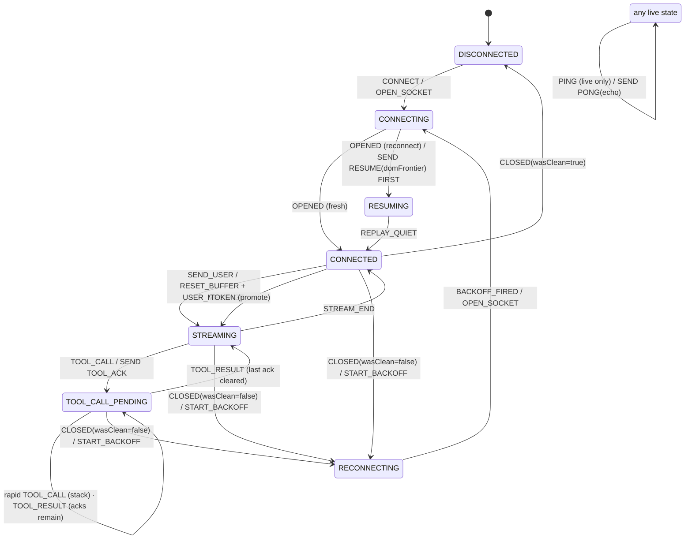

# Agent Console

A resilient streaming client for the mock agent backend. It renders a live,
token-by-token agent response with interrupting tool calls and oversized context
snapshots, and it survives a hostile network — out-of-order frames, duplicates,
corrupt heartbeats, and hard mid-stream disconnects — without losing, dropping,
or duplicating what the user sees.

## Architecture in one breath

Four strictly-separated layers; each is ignorant of the ones above it. The
entire protocol/control core (L2 + L3) is **pure and unit-tested** — no DOM, no
socket — because the parts most likely to be wrong are the parts most worth
proving right.

```
L4  RENDER       components/Console.tsx              clean view-model only; no seq, no socket
L3  CONTROLLER   lib/machine/connectionMachine.ts    pure reduce(state,event) → [state, Command[]]
L2  PROTOCOL     lib/protocol/* , lib/machine/streamModel.ts   reorder, dedupe, segment model, JSON diff
L1  TRANSPORT    lib/transport/*                     raw WebSocket, parse-guard, backoff math
```

Inbound data flows up one layer at a time:

```
socket ──onMessage──▶ reorderBuffer (order + dedupe) ──released──┬─▶ reduce() FSM ──Command[]──▶ executeCommands ──▶ socket.send
                                                                 └─▶ applyMessage ──▶ ChatModel ──▶ React
```

Outbound protocol (PONG / TOOL_ACK / RESUME / USER_MESSAGE) is **never** sent
inline. The pure FSM only *describes* a side-effect as a `Command`; a thin flush
layer (`executeCommands`) performs it. That keeps the reducer testable and makes
ordering guarantees (e.g. "RESUME must be the first frame on reconnect") atomic
rather than effect-timing-dependent.

## Connection state machine



`Event` and `Command` form a closed vocabulary; `reduce` is a single switch and
each transition is one line. While `RESUMING`, all outbound protocol is
suppressed (every replayed frame is read-only history) — the burst end is
detected with a 750ms quiet-timer, safe because RESUME replay bypasses chaos.

See **[DECISIONS.md](./DECISIONS.md)** for the *why* behind every non-obvious
choice (ordering/dedupe, layout-shift prevention, the two frontiers, scaling to
50 streams / 100× responses, and the TOOL_ACK race).

## Running it

This project talks to the provided `agent-server` over `ws://localhost:4747/ws`.

```bash
# 1) backend (plain Node — no Docker needed)
cd agent-server && npm install && npm run build
node dist/index.js                  # normal mode, :4747
node dist/index.js -- --mode chaos  # hostile-network mode

# 2) this client
cd agent-console && npm install
npm run dev                         # http://localhost:3000
```

The WebSocket URL defaults to `ws://localhost:4747/ws` and can be overridden
with `NEXT_PUBLIC_WS_URL`.

### Verifying protocol compliance

The backend records every PONG / TOOL_ACK / RESUME with a verdict:

```bash
curl -s localhost:4747/reset                       # clear state between runs
curl -s localhost:4747/log | python3 -m json.tool  # every entry should be "verdict":"ok"
```

## Tests

```bash
npm run test:run     # 60 unit tests across the pure core
```

Coverage: reorder buffer (ordering, dedupe, per-turn reset), backoff curve,
the full FSM transition table (PING live/replayed/corrupt, RESUME-first,
mid-stream-drop recovery, stacked tools, ACK race), the stream segment model
(token-boundary freeze, reference stability, resume parity), and the JSON diff
engine (incl. a ~500KB perf smoke).

## Tech

Next.js 16 (App Router) · React 19 · TypeScript (strict) · Tailwind v4 ·
Vitest. No runtime dependencies beyond React/Next — the reorder buffer, state
machine, segment model, and diff are all hand-rolled (and unit-tested) rather
than pulled from a library.
